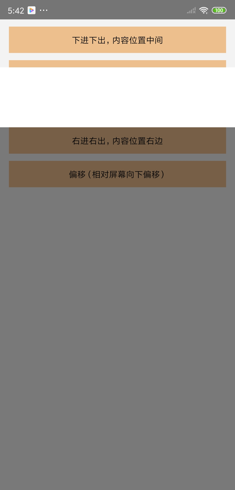

# AnimatedModal
其实就是一个Modal，但是对react-native提供的Modal进行了封装。
加入了动画效果、内容位置等功能，使展示效果更完美。


**支持的动画效果**：
- 淡入/淡出
- 左进/左出
- 上进/上出
- 右进/右出
- 下进/下出

**支持的内容位置**：
- 上、下、左、右、中间

**支持的偏移效果**：
- 背景偏移（向上偏移、向下偏移、向左偏移、向右偏移）
- 内容偏移（暂未开发）

**你可以根据自己的需要，自由组合动画、位置、偏移**
例如：
上进上出 + 内容位置右边 + 偏移
右进右出 + 内容位置下方 + 偏移
等等......

----
### 实例
1. 默认效果（动画“下进下出”，内容位置在中间）


```typescript
<AnimatedModal
    visible={visible1}
    onHide={() => this.onHide(1)}
>
	<View style={{ width: 200, height: 200, backgroundColor: '#FFFFFF' }} />
</AnimatedModal>
```

2. 动画“左进左出”，内容位置在下方


```typescript
<AnimatedModal
  visible={visible2}
  transition="left-in"
  position="bottom"
  onHide={() => this.onHide(2)}
>
	<View style={{ width: 200, height: 200, backgroundColor: '#FFFFFF' }} />
</AnimatedModal>
```

3. 偏移（相对屏幕向下偏移）


```typescript
<AnimatedModal
  visible={visible5}
  transition="top-in"
  position="top"
  offset={{ background: { top: 100 } }}
  onHide={() => this.onHide(5)}
>
	<View style={{ width: width, height: 200, backgroundColor: '#FFFFFF' }} />
</AnimatedModal>
```

4. 其它效果
上进上出、内容位置上方（transition="top-in"，position="top"）
右进右出、内容位置右边（transition="right-in"，position="right"）


5. 当然你也可以根据自己的需要，自由组合动画、位置、偏移

---
### 属性
<table>
  <tr>
    <th>props</th>
    <th>备注</th>
    <th>type</th>
    <th>是否必须</th>
  </tr>
  <tr>
    <td>visible</td>
    <td>弹窗是否展示<br>你也可以通过调用show()/hide()方法控制</td>
    <td>boolean</td>
    <td>非必须，默认false</td>
  </tr>
  <tr>
    <td>visibleBackground</td>
    <td>背景是否展示，若不展示则不会有灰色蒙板</td>
    <td>boolean</td>
    <td>非必须，默认true</td>
  </tr>
  <tr>
    <td>transition</td>
    <td>动画类型</td>
    <td>"fade" (淡入淡出) |<br> "left-in" (左进左出) |<br> "top-in" (上进上出) |<br> "right-in" ( 右进右出) |<br> "bottom-in" (下进下出)</td>
    <td>非必须，默认 "bottom-in"</td>
  </tr>
  <tr>
    <td>position</td>
    <td>内容位置</td>
    <td>"center" |<br> "left" |<br> "top" |<br> "right" |<br> "bottom"</td>
    <td>非必须，默认 "center"</td>
  </tr>
  <tr>
    <td>contentWidth</td>
    <td>内容宽度，如果你已知道内容高度，可以直接传入</td>
    <td>number</td>
    <td>非必须</td>
  </tr>
  <tr>
    <td>contentHeight</td>
    <td>内容高度，如果不传，则会自己计算高度</td>
    <td>number</td>
    <td>非必须</td>
  </tr>
  <tr>
    <td>canceledOnTouchOutside</td>
    <td>点击空白处是否取消</td>
    <td>boolean</td>
    <td>非必须，默认true</td>
  </tr>
  <tr>
    <td>onHide</td>
    <td>弹窗隐藏时的回调</td>
    <td>function</td>
    <td>非必须</td>
  </tr>
  <tr>
    <td>offset</td>
    <td>偏移<br>
      分为<font color="red">背景偏移</font>(background)和<br>
      <font color="red">内容偏移</font>(content 暂未开发)
    </td>
    <td style="min-width:200px">
      <font color="red">background</font>?: {<br>
      &emsp;left?: number,<br>
      &emsp;top?: number,<br>
      &emsp;right?: number,<br>
      &emsp;bottom?: number<br>}<br>
      <font color="red">content</font>?: {<br>
      &emsp;left?: number,<br>
      &emsp;top?: number,<br>
      &emsp;right?: number,<br>
      &emsp;bottom?: number<br>}<br>
    </td>
    <td>非必须，其中每一个属性都是非必须，如果都不传相当于没有偏移</td>
  </tr>
  <tr>
    <td>type</td>
    <td>
      类型<br>
      modal：通过RN带的Modal来展示；<br>
      view：通过控件View来展示。
    </td>
    <td>"modal" |<br>"view"</td>
    <td>非必须，默认为"modal"</td>
  </tr>
</table>
关于偏移：
背景相对于屏幕向左、上、右、下都偏移100px
内容相对于背景向左、上、右都偏移50px（该功能暂时未开发）
offset={{
  background: {
    left: 100,
    top: 100,
    right: 100,
    bottom: 100,
  },
  content: { left: 50, top: 50, right: 50 },
}}
效果图如下：


---
### 方法
<table>
  <tr>
    <th>方法</th>
    <th>备注</th>
  </tr>
  <tr>
    <td>show</td>
    <td>展示弹窗</td>
  </tr>
  <tr>
    <td>hide</td>
    <td>隐藏弹窗</td>
  </tr>
</table>


